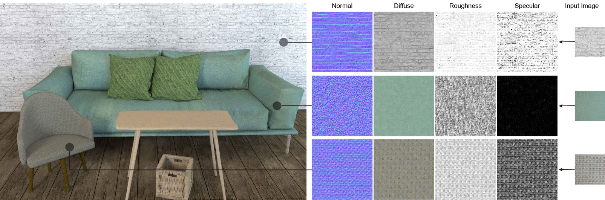

# Joint SVBRDF Recovery and Synthesis  

Source code of our paper: 

[**Joint SVBRDF Recovery and Synthesis From a Single Image using an Unsupervised Generative Adversarial Network**](https://wangningbei.github.io/papers/paper_SVBRDFGan.pdf) ** (EGSR 2020)

Yezi Zhao, [Beibei Wang](https://wangningbei.github.io/)*, Yanning Xu, Zheng Zeng, Lu Wang, Nicolas Holzschuch

(* joint first author)



## Requirements

- Python 3.6, numpy, Tensorflow-gpu 1.4
- 8G GPU Memory (test on GTX 1070)

## Usage

The following command will train the network on a captured image, and output intermediate result during training as well as recovered and synthesized SVBRDF maps of a cental cropped tile of the captured image (considering gpu memory).

```bash
python train.py --input_dir aittalaimgs/plastic_red_input.jpg --log_dir logs/0614-plastic_red --output_dir predictions/0614-plastic_red --crop_size 800
```

`--input_dir`  path to the captured image. We offer several images for testing, and the whole captured images dataset can be find  here: https://mediatech.aalto.fi/publications/graphics/TwoShotSVBRDF/ 

`--log_dir` folder to save checkpoint.

`--output_dir` folder to save recovered SVBRDF maps.

`--crop_size` define the size of a cropped tile from the captured image, default is 800. This tile is to be sent to the network and get 2× size SVBRDF maps.  `crop_size` depends on the GPU memory, larger size might cause OOM error.

`--img_h, --img_w` define the height and width of your captured image, default 1224* 1632. 

## Citation

## Acknowledgements

Implementation based on <https://team.inria.fr/graphdeco/projects/deep-materials/> and modified. We sincerely thank for their great work. 

